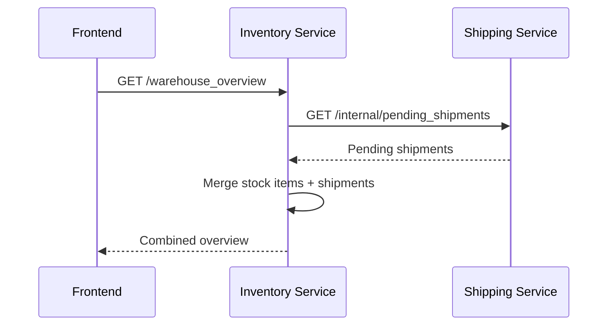
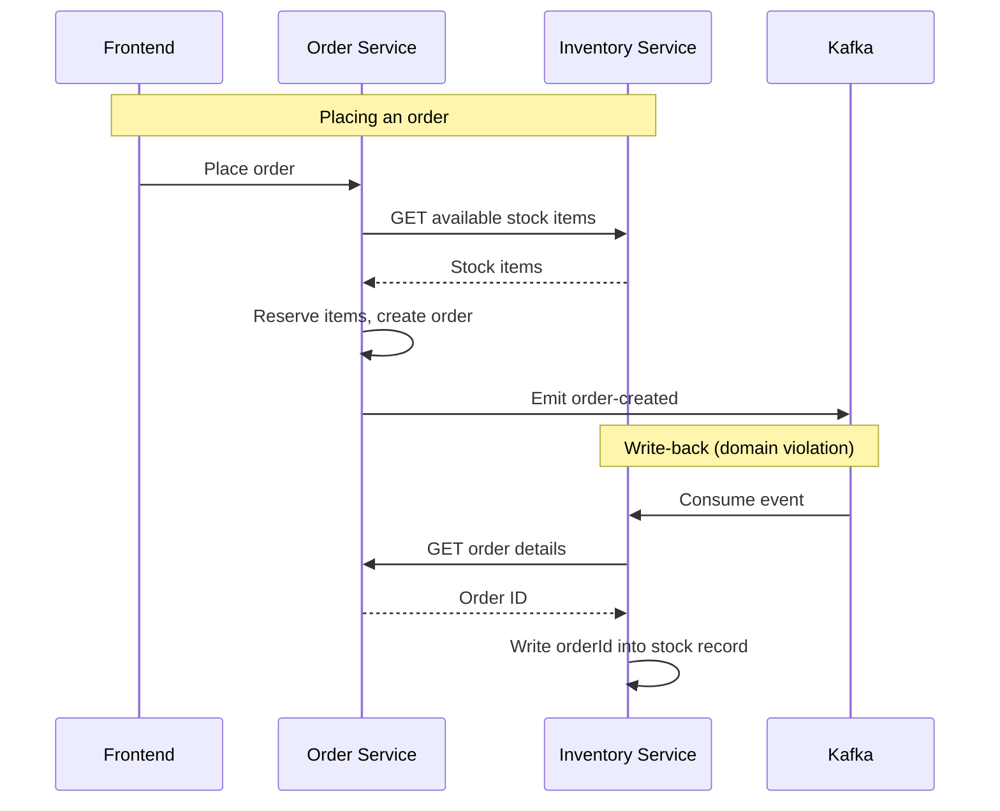
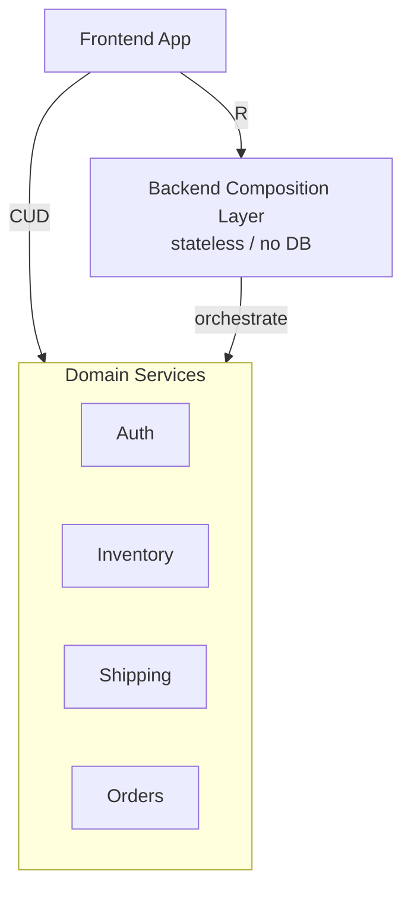
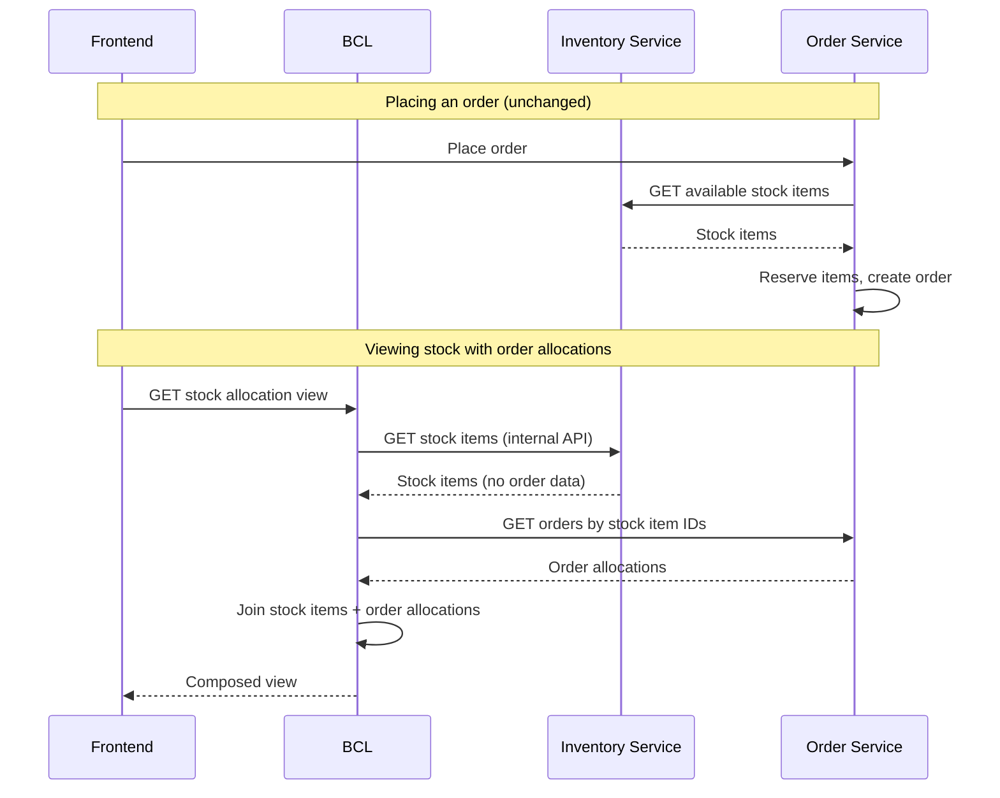

+++
title = "Stop Making Your Microservices Aggregate Each Other's Data"
date = 2026-04-12T10:36:01+08:00
draft = false
description = 'A pattern for separating data ownership from data assembly in microservices systems.'
tags = ['microservices', 'architecture', 'backend', 'design-patterns']
categories = ['Engineering']
mermaid = true
+++

## How It Started

A few months ago, I was reviewing the dependency graph of one of our infrastructure services — an Auth service responsible for session and identity. Something looked off. This service, whose job was to manage authentication, was making outbound calls to four downstream domain services: user profiles, billing, messaging, and a core platform API.

An auth service calling a billing service? That's not authentication. That's aggregation.

I pulled the thread. The Auth service had accumulated these dependencies over time because the frontend needed a "user context" object at login — a blob of data assembled from multiple domains. Nobody had built a place for that composition to happen, so the Auth service became the default. It was the one service every request touched first, so it felt natural to bolt the aggregation on there.

But now the Auth service had a circular dependency. It called domain services that, in turn, depended on the Auth service for authentication. A deployment to any of those downstream services could break login. The blast radius of a billing service bug was now… authentication.

## Why This Is Worse Than It Looks

Circular dependencies between services are bad. But an infrastructure service calling application services is a special kind of bad — it inverts the natural dependency hierarchy and quietly undermines the reliability of your entire system.

In a healthy microservices architecture, the dependency graph flows in one direction: application services depend on infrastructure services (auth, logging, service discovery), never the other way around. Infrastructure sits at the bottom of the stack. It's the foundation. Everything else is built on top of it.

When an infrastructure service like Auth starts calling application services like billing or messaging, the foundation depends on the building. The hierarchy inverts, and several things break at once:

**Your system's availability becomes multiplicative.** Auth is on the critical path of every request. If Auth depends on four downstream services, its effective availability is the *product* of all five services' uptime. If each service is 99.9% available independently, Auth's real availability drops to ~99.5%. Every dependency you add to an infrastructure service directly reduces the reliability of your entire platform.

**Blast radius becomes unpredictable.** A bug in the billing service shouldn't affect login. A slow response from the messaging service shouldn't block session creation. But when Auth calls these services synchronously to assemble a user context, a problem in *any* of them becomes a problem in *all* of them. The team deploying a billing feature now has to worry about breaking authentication — a system they don't own and probably don't understand.

**Deployment coupling spreads invisibly.** You can't safely deploy the billing service anymore without considering whether Auth's aggregation call will handle the new response shape. The billing team didn't sign up for this coupling. It happened one PR at a time, each one looking reasonable in isolation.

**On-call burden shifts to the wrong team.** When login is slow at 2 AM, the Auth team gets paged. They investigate, find the latency is coming from a downstream billing API call, and now they're debugging someone else's service in the middle of the night. The domain team that owns the root cause doesn't even know there's a problem.

This is the real cost of circular dependencies: not just architectural messiness, but operational harm that compounds every time you add a new service to the cycle.

That's when I started looking at the rest of our architecture with fresh eyes. I stopped asking "what does this service do?" and started asking "what is this service doing that isn't its job?"

What I found was a pattern that I suspect exists in most growing microservices systems. And once I saw it, I couldn't unsee it.

## The Pattern Nobody Talks About

Microservices promise independent deployability, clear domain ownership, and team autonomy. In practice, this holds up well — until a frontend needs to display data from multiple services on a single screen.

Someone has to assemble that data. And in most architectures, there's no dedicated layer responsible for this assembly. So the work falls on the services themselves.

This creates two problems that get worse over time. Both violate core microservices design principles. And both turned out to have the same root cause.

## Problem 1: Domain Services Become Ad-Hoc Composition Layers

Here's a scenario that will feel familiar. An e-commerce platform has an Inventory service (stock and warehouse items) and a Shipping service (delivery tracking and logistics). The operations dashboard needs a "Warehouse Overview" — a unified view of stock levels alongside pending shipments.

Where does the aggregation happen? The frontend could call both services and merge the data, but that falls apart once you need server-side pagination across both datasets. Coordinating cursors, sort orders, and page boundaries across two APIs from the client is fragile and slow.

So the team makes the practical choice: the Inventory service adds an internal call to the Shipping service, merges the data, and exposes a single `/warehouse_overview` endpoint.

It works. It ships. Everyone moves on.

But something has shifted. The Inventory service now has two jobs: managing stock items (its actual domain) and aggregating Shipping data (not its domain). It has quietly become a composition layer.

This is the decision that nobody flags in code review. It looks like a reasonable API call. But it violates the **Single Responsibility Principle**. The Inventory service now depends on the Shipping service's internal API contract. A breaking change in Shipping breaks Inventory — even though stock items haven't changed.

Now multiply this across a growing platform. The Auth service fans out to User Profiles, Billing, Notifications, and Permissions to assemble a session context. The Catalog service calls Inventory to enrich product listings. Each time, a domain service takes on composition work that doesn't belong to it.

This is what I found when I traced our own architecture. The services weren't broken — they were just overloaded with everyone else's composition responsibilities.

**The services are independently deployed but operationally coupled.**

## Problem 2: Bidirectional Dependencies Create Hidden Coupling

The second problem is subtler, and I only recognized it after staring at a Kafka topic consumer list wondering why two services were subscribed to each other's events.

Consider the Order service and the Inventory service:

1. To place an order, the Order service reads stock items from the Inventory service — it needs to verify availability and reserve items.
2. After the order is placed, the Inventory service needs to know which order each stock item was allocated to. So it consumes a Kafka event from the Order service and writes the `orderId` back into its own inventory records.

Read that again: the Inventory service stores order data. It owns a field — `orderId` — that belongs to the Order domain. This is a **domain boundary violation**, and it took me a while to see why it matters.

The consequences compound:

- Inventory cannot be deployed independently. It has a runtime dependency on the Order service's Kafka topic and API.
- The two services have a circular dependency: Order reads from Inventory, and Inventory writes data it received from Order.
- Changing how orders reference stock items requires coordinated changes across both services and the event contract between them.

When I drew this on a whiteboard, the circular arrow was obvious. But in code, spread across two repos with a Kafka topic in between, it was invisible for months.

**The services appear decoupled in the architecture diagram but are tightly coupled in practice.**

## The Detour: Solutions That Didn't Fit

Once I identified these two problems, I went through the usual suspects. Each one taught me something about what the actual problem was — and wasn't.

**API Gateway.** My first thought. But API Gateways handle routing, auth, rate limiting — infrastructure concerns. They can't fetch stock items from one service, match them with order allocations from another by ID, and return a merged response. The problem isn't routing. It's data joining.

**CQRS.** Someone on the team suggested this. It separates read and write models — but within a single bounded context. Our problem is cross-service, not within one service. CQRS would be like renovating one room when the problem is the hallway connecting them.

**Saga / Orchestration.** For the write-back problem, a saga would formalize the sequence: check inventory, create order, write order IDs back to Inventory. But the circular dependency still exists — the saga just mediates it. Inventory still stores order data. I realized we weren't looking at a write coordination problem. We were looking at a *read* problem disguised as a write problem.

**GraphQL Federation.** This one actually works. A federated GraphQL gateway can compose data from multiple services at query time. But it requires adopting GraphQL across the entire stack — new schemas, a federation gateway, client-side rewrites, team retraining. It felt like buying a house to fix a leaky faucet.

That's when the real question crystallized: **we don't need a new architecture. We just need a place for cross-domain read composition to live.**

## The Aha Moment

The breakthrough came when I stopped thinking about the write-back as a sync problem and started thinking about it as a composition problem.

Why does the Inventory service store `orderId`? Because the frontend needs to show stock items with their order allocations. Someone decided the cheapest way to serve that view was to bake the order data into the inventory records ahead of time.

But what if we just… didn't? What if the inventory records stayed pure — only inventory data — and we joined them with order data at the moment the frontend asked for the combined view?

The `orderId` field wasn't a data model requirement. It was a caching optimization for a read view, implemented as a permanent write into the wrong service's database. Once I saw it that way, the solution was obvious.

## The Backend Composition Layer

The solution is a dedicated, stateless service whose only job is to compose data from multiple domain services into client-oriented responses. I call it the **Backend Composition Layer** (BCL).

The key principle is a **CUD/R split**:

- **CUD (Create, Update, Delete):** Write operations go directly from the frontend to the owning domain service. The BCL is not involved.
- **R (Read):** Cross-domain read operations go through the BCL, which queries multiple domain services and composes the response.

The BCL has strict constraints, and each one exists for a reason:

| Constraint | Why |
|---|---|
| **No database** | If you need to store data, it belongs in a domain service. No database means the BCL can never quietly become a domain service. |
| **No event bus** | The BCL does not produce or consume events. It's a synchronous composition layer, not an event processor. |
| **No domain logic** | The BCL joins and reshapes data. It does not calculate, validate, or mutate. If you're writing business rules, you're in the wrong service. |
| **Stateless** | The BCL is a pure function: service responses in, composed response out. |

Single-domain reads skip the BCL entirely. If the frontend only needs data from one service, it calls that service directly. The BCL only handles requests that require cross-domain composition.

**The BCL gives composition a home — outside of domain services, where it belongs.**

## Applying the Pattern

Let's revisit the Inventory + Order problem. Instead of Inventory writing `orderId` into its stock records via Kafka, the BCL composes the view at read time.

What changed:

- **Inventory no longer consumes Order events.** The Kafka consumer and write-back are eliminated.
- **Inventory no longer stores `orderId`.** It owns only inventory data.
- **The circular dependency is gone.** Order reads from Inventory (one direction). The BCL reads from both (composition, not coupling).
- **Domain boundaries are restored.** Each service owns only its own data.

The write path is unchanged — placing an order still reads stock items from Inventory directly. Only the read path goes through the BCL.

Notice that the BCL fetches sequentially here — it needs stock item IDs before it can query the Order service for matching allocations. Not all composition is parallelizable. The BCL chooses parallel or sequential fetching based on data dependencies.

**The two-way sync problem was never a sync problem — it was a composition problem being solved at the wrong layer.**

## The Pushback (And Why It Made the Design Better)

When I proposed this to the team, the pushback was immediate and useful. Three objections stood out:

**"You're adding another network hop. How is this faster?"** Fair point. But the hop count doesn't actually change — it just moves. Today, the Inventory service calls the Shipping service internally. With the BCL, the BCL calls both. Same number of hops, but now the composition lives in a layer designed for it, and the BCL can parallelize calls that domain services currently make sequentially.

**"This will become a god service."** This was the concern I took most seriously. The guardrail is the constraint set: no database, no Kafka, no domain logic. If someone tries to add a table or a business rule to the BCL, the answer is always "that belongs in a domain service." The constraints are self-enforcing. The moment the BCL has a database, it's no longer a composition layer — it's a domain service with an identity crisis.

**"Why not just remove the `orderId` field and have the frontend call both services?"** If it were only the `orderId` problem, this would work. But the problem is systemic. The Auth service fans out to four services. The Inventory service aggregates Shipping data. Fixing each one ad-hoc pushes composition into the frontend — which means multiple sequential network calls over the public internet, scattered merge logic across different frontend codebases, and no centralized error handling. The BCL gives all of this a single home.

Each of these objections made the design sharper. The constraint table exists because of the "god service" concern. The CUD/R split exists because of the "extra hop" concern. Good architecture comes from good pushback.

## The Principles Behind It

The BCL isn't a novel invention. It's five well-known microservices principles applied to a specific gap:

**Single Responsibility.** Domain services own their data. The BCL owns composition. The frontend owns rendering. Nobody does someone else's job.

**Domain Ownership.** A service should never store data that belongs to another domain. The BCL eliminates foreign keys across service boundaries by composing the join at read time.

**Statelessness as a Constraint.** The "no database" rule isn't a limitation — it's a design constraint that prevents scope creep. If someone proposes adding a table, that's a signal the data belongs elsewhere.

**Composition Over Coupling.** This is the anchor principle. When two services need to share data for a read view, you can couple them (service A stores data from service B) or compose them (a third actor queries both and joins). The BCL always chooses composition.

**Graceful Degradation.** When a domain service is unavailable, the BCL can return a partial response with clear signals about what's missing. This is impossible in the write-back model — if `orderId` is baked into the stock record, there's no way to distinguish "not yet synced" from "order data unavailable."

**These principles are well-known. The BCL is just a place to apply them.**

## When NOT to Use This Pattern

The BCL is not a universal solution. Skip it when:

- **Single-domain reads.** If the frontend needs data from only one service, call that service directly. Adding a hop with no composition value is just adding latency.
- **Write flows.** CUD operations go directly to the owning domain service. The BCL is read-only. If you find yourself routing writes through it, step back.
- **High-volume joins.** If you need to join millions of records across services on every request, read-time composition may be too slow. Consider materialized views or a dedicated read store.
- **You already have GraphQL Federation.** If your stack already speaks GraphQL with federation, you have a composition layer. You don't need another one.

**The BCL is for targeted, high-value cross-domain reads — not for routing all traffic through a single chokepoint.**

## Getting Started

You don't need to rearchitect your system to adopt this pattern.

Start with one composed view — the one that causes the most pain today. The one where a service is calling two other services to assemble a response that isn't really its job. Build a stateless service, compose two domain service responses, and point the frontend at it.

Once that works, expand. Add the next highest-value composed view. Then the next. Migration is incremental — each frontend view can adopt the BCL independently while direct service calls continue to work.

The pattern is lightweight. No new infrastructure. No schema migration. No event sourcing. Just a stateless service that gives composition a proper home.

That Auth service I mentioned at the start? With the BCL in place, it goes back to doing one thing: authentication. The user context assembly moves to the BCL, where it belongs. The Auth service no longer has circular dependencies on downstream domain services. A billing service deployment can't break login anymore.

Sometimes the best architecture isn't the most clever one. It's the one that gives each responsibility a proper home.

**Composition replaces coupling as the primary integration mechanism.**
